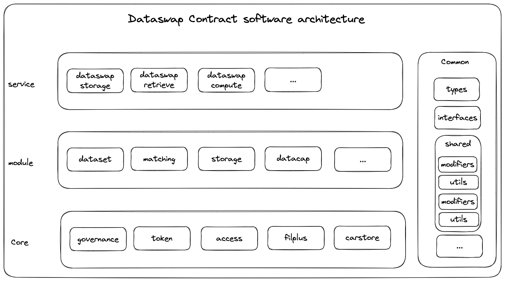

# Dataswap  contract software architecture

### I. software layer architecture


### II. Basic source code structure.
```
├── interfaces
│   ├── core
│   │   ├── ICore1.sol
│   ├── module
│   │   ├── IModule1.sol
│   └── service
├── core
│   ├── core1
│   │   ├── abstract 
│   │   │   └── Core1Base.so 
│   │   ├── library 
│   │   │   └── Core1LIB.sol
│   │   └── Core1.sol 
│   └── ...
├── modules
│   ├── module1
│   │   ├── abstract 
│   │   │   └── Module1Base.sol
│   │   ├── library 
│   │   │   └── Module1LIB.sol
│   │   └── Module1.sol 
│   └── ...
├── mocks
├── shared
└── types
```